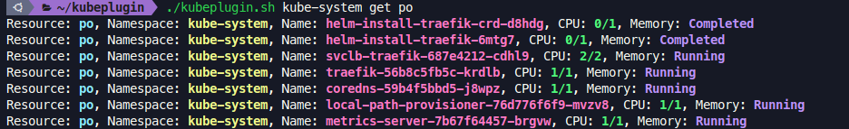

# Інструкція до користування плігіном kubeplugin :computer:
[Watch a DEMO](#demo)
## **✅ Інструкція**:
- [x]    :warning: Будь ласка, зверніть увагу, що для використання цього скрипта вам потрібно мати встановлену утиліту [kubectl](https://kubernetes.io/docs/tasks/tools/)  та мати налаштований доступ до кластера Kubernetes.


1.  Склонуйте репозиторій з кодом :clipboard:, використовуючи команду:
```sh
git clone <URL репозиторію>
```
2.  Перейдіть у папку зі скриптами :file_folder:, використовуючи  
```sh
cd scripts/kubeplugin
```
3.  Щоб надати файлу права на виконання :key: - виконайте команду 
```sh
chmod +x kubeplugin.sh
```
4.  Виконайте команду :rocket:
```sh
~./kubeplugin.sh <command> <resource_type>
```
>   `<command>` та `<resource_type>` відповідають вашим потребам. -   `<command>`: команда `kubectl`, яку ви хочете виконати. Наприклад, `top pod` або `get pod`.
    -   `<resource_type>`: тип ресурсу Kubernetes, для якого ви хочете отримати статистику. Наприклад, `pod`, `deployment` або `service`.
 
5.  зразок команди, яку можна виконати :memo:
```sh
./kubectl.sh default get pods
```
> результат команди:
[> Resource: pods, Namespace: default, Name: pod1, Namespace: kube-system, Name: helm-install-traefik-crd-d8hdg, CPU: 0/1, Memory: Completed
Resource: po, Namespace: kube-system, Name: helm-install-traefik-6mtg7, CPU: 0/1, Memory: Completed
Resource: po, Namespace: kube-system, Name: svclb-traefik-687e4212-cdhl9, CPU: 0.52/2, Memory: 256Mi
> Running
Resource: pods, Namespace: default, Name: pod2kube-system, Name: traefik-56b8c5fb5c-krdlb, CPU: 1/1, Memory: Running
Resource: po, Namespace: kube-system, Name: coredns-59b4f5bbd5-j8wpz, CPU: 0.31/1, Memory: 128Mi
> Running
Resource: pods, Namespace: default, Name: pod3kube-system, Name: local-path-provisioner-76d776f6f9-mvzv8, CPU: 0.81/1, Memory: 512MiRunning
Resource: po, Namespace: kube-system, Name: metrics-server-7b67f64457-brgvw, CPU: 1/1, Memory: Running
6.  результати виконання плагіну kubeplugin буде `будуть виведені у форматі "Resource, Namespace, Name, CPU, Memory"` :chart_with_upwards_trend:

----------------------------------------------------------------------
<h4 id="demo">

## 🎥 [#Демонстрація](#демонстрація)
